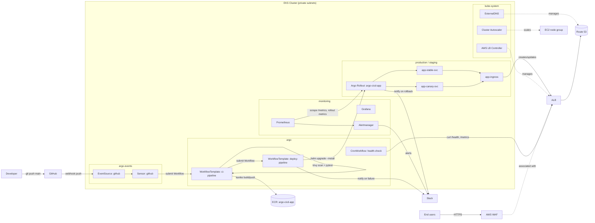

# argo-cicd-platform

A production-grade CI/CD platform on AWS: `git push` → Argo Events → Argo Workflows
(build/test/scan/push) → Argo Workflows (deploy) → Argo Rollouts canary on EKS, behind
an ALB protected by AWS WAF, with DNS automation and Prometheus/Grafana monitoring.

## Architecture



## Prerequisites

- [AWS CLI](https://docs.aws.amazon.com/cli/) v2, configured with credentials that can
  create VPC/EKS/IAM/ECR/WAF/Route53 resources
- [Terraform](https://developer.hashicorp.com/terraform) >= 1.5
- [kubectl](https://kubernetes.io/docs/tasks/tools/) >= 1.35
- [Helm](https://helm.sh/) >= 3.12
- [Argo CLI](https://argo-workflows.readthedocs.io/en/latest/walk-through/argo-cli/)
  and the [Argo Rollouts kubectl plugin](https://argo-rollouts.readthedocs.io/en/stable/installation/#kubectl-plugin)
  (the plugin is also installed by `scripts/bootstrap.sh`)
- An existing Route 53 **public hosted zone** you control (for `hosted_zone_name`)
- A Slack **incoming webhook URL** for CI/CD and alert notifications

## Setup

This repo includes a `Makefile` that wires together every step below in order. Run
`make help` at any time to see the full target list and the recommended run order.

### 0. Configure variables and secrets

```bash
cd terraform
cp terraform.tfvars.example terraform.tfvars
# edit terraform.tfvars: hosted_zone_name, app_hostname, slack_webhook_url, aws_region, ...
cd ..

cp .env.example .env
# edit .env: SLACK_WEBHOOK_URL, GITHUB_PAT, GITHUB_WEBHOOK_SECRET
```

`.env` is gitignored and read automatically by `make bootstrap`,
`make fill-slack-secret`, and `make github-secret` — never commit it.

### 1. Provision AWS infrastructure

```bash
make tf-init
make tf-validate
make tf-apply
```

This creates the VPC, EKS cluster (private nodes), ECR repo, IRSA roles, WAF Web
ACL, and installs the AWS Load Balancer Controller, ExternalDNS and Cluster
Autoscaler via Helm.

### 2. Fill in placeholders from the Terraform outputs

```bash
make fill-placeholders
```

Replaces `<ECR_URI>` / `<ECR_REPO_URI>` / `<ARGO_WORKFLOWS_ECR_ROLE_ARN>` in
`helm/app/values.yaml`, `argo/rollouts/rollout-production.yaml`,
`argo/events/sensor-github.yaml`, `argo/workflows/workflow-template-deploy.yaml`, and
`argo/workflows/serviceaccount.yaml` using `terraform output`.

### 3. Point kubectl/helm at the new cluster

```bash
make kubeconfig
```

Runs `aws eks update-kubeconfig` using the `cluster_name`/`aws_region` from the
Terraform outputs.

### 4. Install the Argo ecosystem + monitoring

```bash
make bootstrap
```

Installs, in order: Argo Workflows (`argo`), Argo Events (`argo-events`), Argo
Rollouts (`argo-rollouts`), the `kubectl-argo-rollouts` plugin, and
`kube-prometheus-stack` (`monitoring`). Reads `SLACK_WEBHOOK_URL` from `.env`.

### 5. Fill in the Slack webhook placeholder

```bash
make fill-slack-secret
```

Replaces `<SLACK_WEBHOOK_URL>` in `argo/rollouts/analysis-template.yaml`. Reads
`SLACK_WEBHOOK_URL` from `.env`.

### 6. Create the GitHub webhook credentials secret

```bash
make github-secret
```

Creates the `github-access` Secret in `argo-events` (GitHub PAT + webhook shared
secret) from `GITHUB_PAT`/`GITHUB_WEBHOOK_SECRET` in `.env`. The PAT needs
`admin:repo_hook`/`repo` scope so the EventSource can auto-register the webhook.

> `argo/events/event-source-github.yaml` is already set up for the
> `mkhamisi2007/Argo-CICD-Platform` GitHub repo and the `m-khamisi.com` domain
> (`hosted_zone_name`/`app_hostname` in `terraform.tfvars.example`). Update these if
> you fork or rename the repo.

### 7. Apply the Argo manifests

```bash
make apply-argo
```

Applies `argo/workflows/`, `argo/events/` (including the GitHub webhook Ingress),
`argo/rollouts/`, and `argo/cron/`.

### 8. Re-run terraform apply to associate WAF with the ALB

```bash
make tf-apply
```

> WAF ↔ ALB association: the ALB is created by the AWS Load Balancer Controller only
> once the Ingresses from step 7 exist. This second `terraform apply` lets
> `aws_wafv2_web_acl_association` pick up the new ALB ARN.

## Triggering a deployment

Push to `main`:

```bash
git push origin main
```

The GitHub `push` webhook → `argo-events` Sensor → submits a Workflow from
`ci-pipeline` (clone → kaniko build → pytest + trivy scan → push to ECR → trigger
`deploy-pipeline` for `staging`).

Watch it:

```bash
argo list -n argo
argo logs -n argo @latest -f
```

## Watching a canary rollout

Once `deploy-pipeline` runs for `environment: production`, Argo Rollouts starts the
canary defined in `helm/app/templates/deployment.yaml` (10% → analysis → 50% →
analysis → 100%, ~2 minute pauses between steps).

```bash
kubectl argo rollouts get rollout argo-cicd-app -n production --watch
```

Or open the Argo Rollouts dashboard:

```bash
kubectl argo rollouts dashboard -n argo-rollouts
```

## Manually approving staging → production

`deploy-pipeline` suspends after the staging smoke test + integration test. List
suspended workflows and resume the one for your build:

```bash
argo list -n argo
argo resume -n argo <deploy-staging-xxxxx>
```

Resuming runs `trigger-production`, which submits a new `deploy-pipeline` Workflow
with `environment: production`.

> If multiple `deploy-staging-*` workflows pile up suspended at `approve-production`
> (e.g. several pushes landed before you approved), only resume the one with the
> `image-tag` you want in production and `argo stop -n argo <name>` the rest —
> otherwise each resumed workflow will independently trigger its own production
> deploy.

## Forcing a rollback

If a canary analysis fails, Argo Rollouts aborts and rolls back automatically (and
posts to Slack via the notification subscription in
`argo/rollouts/analysis-template.yaml`). To force an abort/rollback manually:

```bash
kubectl argo rollouts abort argo-cicd-app -n production
kubectl argo rollouts undo argo-cicd-app -n production
```

## Troubleshooting

Issues found and fixed while exercising the full pipeline against a live AWS account:

**A host (`app.<domain>` / `staging.app.<domain>` / `webhook.app.<domain>`) returns
`000`/connection refused, with no matching `TargetGroupBinding`:**
The shared ALB IngressGroup (`group.name: argo-cicd-platform`) merges all member
Ingresses into one model. If an Ingress is missing
`alb.ingress.kubernetes.io/listen-ports: '[{"HTTP": 80}, {"HTTPS": 443}]'`, it defaults
to HTTP:80-only — and if another member's `ssl-redirect` has taken over the group's
port-80 listener, this Ingress's rule is **silently dropped from the merged model**
(no warning at any log level). Check the annotation is present on
`helm/app/templates/ingress.yaml` (via `helm/app/values.yaml`) and
`argo/events/ingress-webhook.yaml`, then force a reconcile:

```bash
kubectl annotate ingress -n <namespace> app-ingress reconcile-trigger=$(date +%s) --overwrite
```

**`kubectl describe ingress` shows repeated `Warning FailedDeployModel ...
elasticloadbalancing:SetRulePriorities ... AccessDenied`:**
The AWS Load Balancer Controller's IAM policy
(`terraform/modules/security/policies/alb-controller-policy.json`) is missing
`elasticloadbalancing:SetRulePriorities`, needed once the IngressGroup has 3+ member
Ingresses (it has to reorder existing rule priorities to insert a new host rule). Fix
the policy and `terraform apply` (updates the existing `aws_iam_policy` in place — no
role/attachment changes), then re-annotate the Ingress as above.

**To inspect what the ALB controller actually built for the IngressGroup**, temporarily
enable debug logging (use `--log-level=debug`, **not** `--v=4` — the latter crashes
v3.4.0):

```bash
kubectl patch deployment -n kube-system aws-load-balancer-controller --type=json \
  -p='[{"op":"add","path":"/spec/template/spec/containers/0/args/-","value":"--log-level=debug"}]'
# ... trigger a reconcile, grep the leader pod's logs for "successfully built model" ...
kubectl patch deployment -n kube-system aws-load-balancer-controller --type=json \
  -p='[{"op":"remove","path":"/spec/template/spec/containers/0/args/4"}]'
```

**`deploy-helm` step fails with `UPGRADE FAILED: resource Rollout/<ns>/argo-cicd-app
not ready ... context deadline exceeded`, even though
`kubectl argo rollouts get rollout` shows it Healthy:**
This was a pre-existing bug, now fixed — `deploy-helm` no longer passes
`--wait --timeout` to `helm upgrade --install`. Helm's generic CRD-readiness check
looks for a `status.conditions[].type == "Ready"` condition that the Argo Rollouts CRD
never sets. `smoke-test` (poll `/health`) is the readiness gate instead.

**`deploy-helm` / `smoke-test` fails with `cannot be imported ... invalid ownership
metadata` or `Service "app-stable-svc" has unmatch label ... in rollout`:**
The production `Rollout` was originally created by a raw `kubectl apply -f
argo/rollouts/` during bootstrap, with different labels than
`helm/app/templates/_helpers.tpl`'s `selectorLabels`. Helm can adopt an existing
resource (label `app.kubernetes.io/managed-by: Helm` +
`meta.helm.sh/release-name`/`release-namespace` annotations), but `spec.selector` is
effectively immutable — `helm upgrade` reports success without actually fixing it. If
this happens: `kubectl delete rollout -n <namespace> argo-cicd-app` (safe once it has
0 ready replicas under the old selector) and re-run `helm upgrade --install`, which
recreates it correctly.

## Estimated AWS cost

~**$80–120/month**, dominated by:

- 2× `t3.medium` EKS worker nodes (~$60/month)
- 1× NAT Gateway (~$33/month + data processing)
- 1× Application Load Balancer (~$16/month + LCU usage)
- AWS WAF Web ACL + rules (~$5–10/month + request volume)
- ECR storage (last 10 images, minimal)

EKS control plane (~$73/month) is **not** included above per AWS's current free
control-plane pricing in most regions — check current pricing for `eu-west-3`.

## Teardown

```bash
make teardown      # removes Argo/monitoring + the app's ALB & DNS records
make tf-destroy
```

Running `make teardown` first lets the AWS Load Balancer Controller and ExternalDNS
deprovision the ALB and Route 53 records before the VPC/EKS cluster they depend on
is destroyed.
