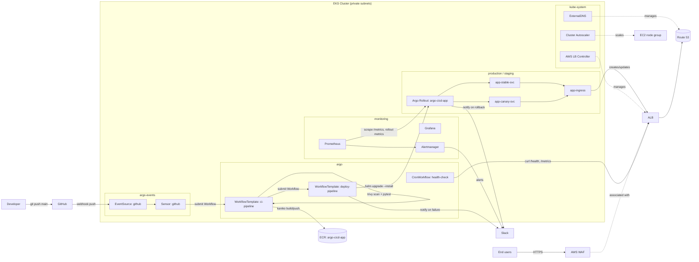

# argo-cicd-platform

A production-grade CI/CD platform on AWS: `git push` → Argo Events → Argo Workflows
(build/test/scan/push) → Argo Workflows (deploy) → Argo Rollouts canary on EKS, behind
an ALB protected by AWS WAF, with DNS automation and Prometheus/Grafana monitoring.

## Architecture



## Prerequisites

- [AWS CLI](https://docs.aws.amazon.com/cli/) v2, configured with credentials that can
  create VPC/EKS/IAM/ECR/WAF/Route53 resources
- [Terraform](https://developer.hashicorp.com/terraform) >= 1.5
- [kubectl](https://kubernetes.io/docs/tasks/tools/) >= 1.35
- [Helm](https://helm.sh/) >= 3.12
- [Argo CLI](https://argo-workflows.readthedocs.io/en/latest/walk-through/argo-cli/)
  and the [Argo Rollouts kubectl plugin](https://argo-rollouts.readthedocs.io/en/stable/installation/#kubectl-plugin)
  (the plugin is also installed by `scripts/bootstrap.sh`)
- An existing Route 53 **public hosted zone** you control (for `hosted_zone_name`)
- A Slack **incoming webhook URL** for CI/CD and alert notifications

## Setup

### 1. Provision AWS infrastructure

```bash
cd terraform
cp terraform.tfvars.example terraform.tfvars
# edit terraform.tfvars: hosted_zone_name, app_hostname, slack_webhook_url, ...

terraform init
terraform apply
```

This creates the VPC, EKS cluster (private nodes), ECR repo, IRSA roles, WAF Web
ACL, and installs the AWS Load Balancer Controller, ExternalDNS and Cluster
Autoscaler via Helm.

Point `kubectl`/`helm` at the new cluster (use your `cluster_name`/`aws_region`
from `terraform.tfvars`):

```bash
aws eks update-kubeconfig --name argo-cicd-cluster --region eu-west-3
```

### 2. Install the Argo ecosystem + monitoring

```bash
export SLACK_WEBHOOK_URL="https://hooks.slack.com/services/..."
./scripts/bootstrap.sh
```

Installs, in order: Argo Workflows (`argo`), Argo Events (`argo-events`), Argo
Rollouts (`argo-rollouts`), the `kubectl-argo-rollouts` plugin, and
`kube-prometheus-stack` (`monitoring`).

### 3. Apply the Argo manifests

Fill in the remaining placeholders first (the script prints exactly which ones):

| File | Placeholder | Value |
|------|-------------|-------|
| `argo/workflows/serviceaccount.yaml` | `<ARGO_WORKFLOWS_ECR_ROLE_ARN>` | `aws iam get-role --role-name argo-workflows-ecr --query Role.Arn --output text` |
| `argo/events/sensor-github.yaml`, `argo/rollouts/rollout-production.yaml` | `<ECR_REPO_URI>` / `<ECR_URI>` | `terraform output -raw ecr_repository_url` |
| `argo/rollouts/analysis-template.yaml` | `<SLACK_WEBHOOK_URL>` | your Slack webhook (also set by `bootstrap.sh` as a Secret) |

> `argo/events/event-source-github.yaml` is already set up for the
> `mkhamisi2007/argo-cicd-platform` GitHub repo and the `m-khamisi.com` domain
> (`hosted_zone_name`/`app_hostname` in `terraform.tfvars.example`). Update these if
> you fork or rename the repo.

Create the GitHub webhook credentials secret:

```bash
kubectl create secret generic github-access -n argo-events \
  --from-literal=token="<GITHUB_PAT>" \
  --from-literal=secret="<WEBHOOK_SHARED_SECRET>"
```

Then apply everything:

```bash
kubectl apply -f argo/workflows/
kubectl apply -f argo/events/
kubectl apply -f argo/rollouts/
kubectl apply -f argo/cron/
```

> WAF ↔ ALB association: the ALB is created by the AWS Load Balancer Controller only
> once the Ingress above exists. Re-run `terraform apply` afterwards so
> `aws_wafv2_web_acl_association` picks up the new ALB ARN.

## Triggering a deployment

Push to `main`:

```bash
git push origin main
```

The GitHub `push` webhook → `argo-events` Sensor → submits a Workflow from
`ci-pipeline` (clone → kaniko build → pytest + trivy scan → push to ECR → trigger
`deploy-pipeline` for `staging`).

Watch it:

```bash
argo list -n argo
argo logs -n argo @latest -f
```

## Watching a canary rollout

Once `deploy-pipeline` runs for `environment: production`, Argo Rollouts starts the
canary defined in `helm/app/templates/deployment.yaml` (10% → analysis → 50% →
analysis → 100%, ~2 minute pauses between steps).

```bash
kubectl argo rollouts get rollout argo-cicd-app -n production --watch
```

Or open the Argo Rollouts dashboard:

```bash
kubectl argo rollouts dashboard -n argo-rollouts
```

## Manually approving staging → production

`deploy-pipeline` suspends after the staging smoke test + integration test. List
suspended workflows and resume the one for your build:

```bash
argo list -n argo
argo resume -n argo <deploy-staging-xxxxx>
```

Resuming runs `trigger-production`, which submits a new `deploy-pipeline` Workflow
with `environment: production`.

## Forcing a rollback

If a canary analysis fails, Argo Rollouts aborts and rolls back automatically (and
posts to Slack via the notification subscription in
`argo/rollouts/analysis-template.yaml`). To force an abort/rollback manually:

```bash
kubectl argo rollouts abort argo-cicd-app -n production
kubectl argo rollouts undo argo-cicd-app -n production
```

## Estimated AWS cost

~**$80–120/month**, dominated by:

- 2× `t3.medium` EKS worker nodes (~$60/month)
- 1× NAT Gateway (~$33/month + data processing)
- 1× Application Load Balancer (~$16/month + LCU usage)
- AWS WAF Web ACL + rules (~$5–10/month + request volume)
- ECR storage (last 10 images, minimal)

EKS control plane (~$73/month) is **not** included above per AWS's current free
control-plane pricing in most regions — check current pricing for `eu-west-3`.

## Teardown

```bash
./scripts/teardown.sh   # removes Argo/monitoring + the app's ALB & DNS records
cd terraform && terraform destroy
```

Running `teardown.sh` first lets the AWS Load Balancer Controller and ExternalDNS
deprovision the ALB and Route 53 records before the VPC/EKS cluster they depend on
is destroyed.
