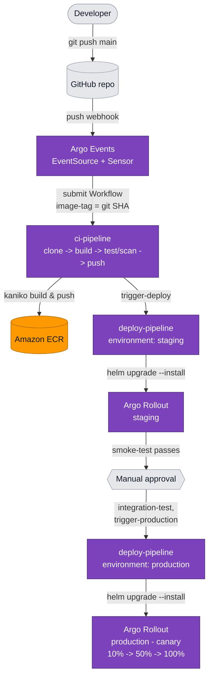
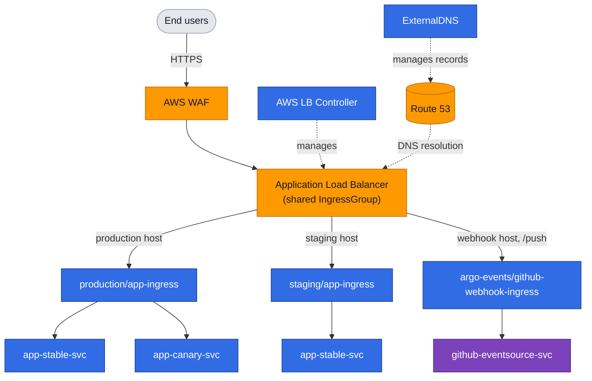
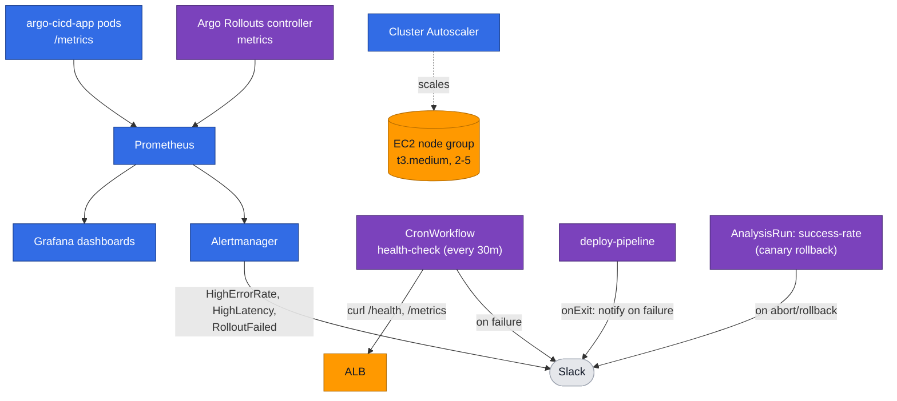

# argo-cicd-platform

A production-grade CI/CD platform on AWS: `git push` → Argo Events → Argo Workflows
(build/test/scan/push) → Argo Workflows (deploy) → Argo Rollouts canary on EKS, behind
an ALB protected by AWS WAF, with DNS automation and Prometheus/Grafana monitoring.

## Architecture

The platform is shown below as three focused diagrams: the **CI/CD pipeline** (how a
commit becomes a running canary), **traffic & networking** (how requests reach the
app), and **observability, notifications & autoscaling**.

### CI/CD pipeline



### Traffic & networking

Production, staging, and the GitHub webhook all share **one ALB** via a single
`IngressGroup` (`alb.ingress.kubernetes.io/group.name: argo-cicd-platform`), with
host-based routing rules for each.



### Observability, notifications & autoscaling



## EKS add-ons

In addition to the Argo ecosystem (Workflows/Events/Rollouts) and the
kube-prometheus-stack, the cluster runs the following add-ons:

| Add-on | Installed via | Purpose |
| --- | --- | --- |
| **VPC CNI**, **kube-proxy**, **CoreDNS** | `aws_eks_addon` (`terraform/modules/eks`) | Default EKS networking/DNS add-ons, managed by EKS. |
| **Amazon EBS CSI Driver** | `aws_eks_addon` (`terraform/storage.tf`) + IRSA | Provisions EBS volumes for `PersistentVolumeClaim`s (e.g. Prometheus/Alertmanager storage). |
| **AWS Load Balancer Controller** | `helm_release` (`terraform/alb.tf`) + IRSA | Turns `Ingress`/`Service` objects into ALBs/target groups — provisions the shared ALB for the app, staging, webhook and Grafana ingresses. |
| **ExternalDNS** | `helm_release` (`terraform/route53.tf`) + IRSA | Watches Ingresses and creates/updates Route 53 records (`app.`, `staging.app.`, `grafana.app.<domain>`, etc.) pointing at the ALB. |
| **Cluster Autoscaler** | `helm_release` (`terraform/autoscaler.tf`) + IRSA | Scales the managed node group's ASG (2-5 `t3.medium`) up/down based on pending pods. |
| **yet-another-cloudwatch-exporter (YACE)** | `helm_release` (`terraform/cloudwatch-exporter.tf`) + IRSA | Polls CloudWatch (`AWS/WAFV2 BlockedRequests` for the `argo-cicd-cluster-waf` Web ACL) and exposes it to Prometheus for the "WAF Blocked Requests" Grafana panel. |

Each `helm_release` add-on uses **IRSA** (IAM Roles for Service Accounts): a
per-add-on IAM role, trusted via the cluster's OIDC provider and scoped to a single
`system:serviceaccount:<namespace>:<name>`, is defined in
`terraform/modules/security/irsa.tf` and attached to the Helm-managed service account
via the `eks.amazonaws.com/role-arn` annotation.

## Prerequisites

- [AWS CLI](https://docs.aws.amazon.com/cli/) v2, configured with credentials that can
  create VPC/EKS/IAM/ECR/WAF/Route53 resources
- [Terraform](https://developer.hashicorp.com/terraform) >= 1.5
- [kubectl](https://kubernetes.io/docs/tasks/tools/) >= 1.35
- [Helm](https://helm.sh/) >= 3.12
- [Argo CLI](https://argo-workflows.readthedocs.io/en/latest/walk-through/argo-cli/)
  and the [Argo Rollouts kubectl plugin](https://argo-rollouts.readthedocs.io/en/stable/installation/#kubectl-plugin)
  (the plugin is also installed by `scripts/bootstrap.sh`)
- An existing Route 53 **public hosted zone** you control (for `hosted_zone_name`)
- A Slack **incoming webhook URL** for CI/CD and alert notifications

## Setup

This repo includes a `Makefile` that wires together every step below in order. Run
`make help` at any time to see the full target list and the recommended run order.

### 0. Configure variables and secrets

```bash
cd terraform
cp terraform.tfvars.example terraform.tfvars
# edit terraform.tfvars: hosted_zone_name, app_hostname, slack_webhook_url, aws_region, ...
cd ..

cp .env.example .env
# edit .env: SLACK_WEBHOOK_URL, GITHUB_PAT, GITHUB_WEBHOOK_SECRET
```

`.env` is gitignored and read automatically by `make bootstrap`,
`make fill-slack-secret`, and `make github-secret` — never commit it.

### 1. Provision AWS infrastructure

```bash
make tf-init
make tf-validate
make tf-apply
```

This creates the VPC, EKS cluster (private nodes), ECR repo, IRSA roles, WAF Web
ACL, and installs the AWS Load Balancer Controller, ExternalDNS and Cluster
Autoscaler via Helm.

### 2. Fill in placeholders from the Terraform outputs

```bash
make fill-placeholders
```

Replaces `<ECR_URI>` / `<ECR_REPO_URI>` / `<ARGO_WORKFLOWS_ECR_ROLE_ARN>` in
`helm/app/values.yaml`, `argo/rollouts/rollout-production.yaml`,
`argo/events/sensor-github.yaml`, `argo/workflows/workflow-template-deploy.yaml`, and
`argo/workflows/serviceaccount.yaml` using `terraform output`.

### 3. Point kubectl/helm at the new cluster

```bash
make kubeconfig
```

Runs `aws eks update-kubeconfig` using the `cluster_name`/`aws_region` from the
Terraform outputs.

### 4. Install the Argo ecosystem + monitoring

```bash
make bootstrap
```

Installs, in order: Argo Workflows (`argo`), Argo Events (`argo-events`), Argo
Rollouts (`argo-rollouts`), the `kubectl-argo-rollouts` plugin, and
`kube-prometheus-stack` (`monitoring`). Reads `SLACK_WEBHOOK_URL` from `.env`.

### 5. Fill in the Slack webhook placeholder

```bash
make fill-slack-secret
```

Replaces `<SLACK_WEBHOOK_URL>` in `argo/rollouts/analysis-template.yaml`. Reads
`SLACK_WEBHOOK_URL` from `.env`.

### 6. Create the GitHub webhook credentials secret

```bash
make github-secret
```

Creates the `github-access` Secret in `argo-events` (GitHub PAT + webhook shared
secret) from `GITHUB_PAT`/`GITHUB_WEBHOOK_SECRET` in `.env`. The PAT needs
`admin:repo_hook`/`repo` scope so the EventSource can auto-register the webhook.

> `argo/events/event-source-github.yaml` is already set up for the
> `mkhamisi2007/Argo-CICD-Platform` GitHub repo and the `m-khamisi.com` domain
> (`hosted_zone_name`/`app_hostname` in `terraform.tfvars.example`). Update these if
> you fork or rename the repo.

### 7. Apply the Argo manifests

```bash
make apply-argo
```

Applies `argo/workflows/`, `argo/events/` (including the GitHub webhook Ingress),
`argo/rollouts/`, and `argo/cron/`.

### 8. Re-run terraform apply to associate WAF with the ALB

```bash
make tf-apply
```

> WAF ↔ ALB association: the ALB is created by the AWS Load Balancer Controller only
> once the Ingresses from step 7 exist. This second `terraform apply` lets
> `aws_wafv2_web_acl_association` pick up the new ALB ARN.

## Triggering a deployment

Push to `main`:

```bash
git push origin main
```

The GitHub `push` webhook → `argo-events` Sensor → submits a Workflow from
`ci-pipeline` (clone → kaniko build → pytest + trivy scan → push to ECR → trigger
`deploy-pipeline` for `staging`).

Watch it:

```bash
argo list -n argo
argo logs -n argo @latest -f
```

## Watching a canary rollout

Once `deploy-pipeline` runs for `environment: production`, Argo Rollouts starts the
canary defined in `helm/app/templates/deployment.yaml` (10% → analysis → 50% →
analysis → 100%, ~2 minute pauses between steps).

```bash
kubectl argo rollouts get rollout argo-cicd-app -n production --watch
```

Or open the Argo Rollouts dashboard:

```bash
kubectl argo rollouts dashboard -n argo-rollouts
```

## Monitoring (Grafana)

Grafana is exposed on the shared ALB IngressGroup at `https://grafana.app.m-khamisi.com`
(`monitoring/prometheus-values.yaml`'s `grafana.ingress`, applied via
`helm upgrade --install prometheus-stack ...`). ExternalDNS creates the DNS record
automatically; the ACM certificate's `*.app.m-khamisi.com` SAN covers it.

```bash
open https://grafana.app.m-khamisi.com
```

Username is `admin`; get the auto-generated password with:

```bash
kubectl get secret -n monitoring prometheus-stack-grafana -o jsonpath='{.data.admin-password}' | base64 -d; echo
```

### The `argo-cicd-platform` dashboard

Provisioned via `make apply-grafana-dashboard` (`monitoring/grafana-dashboard.json`,
loaded by the kube-prometheus-stack dashboard sidecar). It auto-refreshes every 30s
over a 6h window and has 6 panels:

| # | Panel | What it shows | Query source |
| --- | --- | --- | --- |
| 1 | **Request Rate (req/s)** | Throughput of the app — total HTTP requests/sec, averaged over a 5-min window. | `http_requests_total` from the app's `/metrics` endpoint (`prometheus-fastapi-instrumentator`). |
| 2 | **Error Rate (%)** | Percentage of requests returning a `5xx` status, over the same 5-min window. `or vector(0)` shows `0%` instead of "no data" when there are zero errors. | Same `http_requests_total`, filtered by `status=~"5.."`. |
| 3 | **p99 Latency (ms)** | 99th-percentile response time — the slowest 1% of requests. Early-warning signal for performance regressions. | `http_request_duration_seconds_bucket` histogram via `histogram_quantile(0.99, ...)`. |
| 4 | **Rollout Phase** | State of the production Argo Rollout (canary deploy) over time — one line per phase (`Progressing`, `Paused`, `Healthy`, `Degraded`, `Aborted`, etc.), so you can see exactly when a deploy entered/left each phase. | `rollout_phase{exported_namespace="production", name="argo-cicd-app"}` from the Argo Rollouts controller. |
| 5 | **Node Count** | Number of "ready" EC2 nodes in the EKS managed node group — visualizes Cluster Autoscaler scaling the cluster (2-5 `t3.medium`). | `cluster_autoscaler_nodes_count{state="ready"}`. |
| 6 | **WAF Blocked Requests** | Requests AWS WAF blocked in the last 5-minute CloudWatch window for the `argo-cicd-cluster-waf` Web ACL — surfaces malicious/rate-limited traffic hitting the ALB. | `aws_wafv2_blocked_requests_sum{dimension_WebACL="argo-cicd-cluster-waf"}` via the YACE CloudWatch exporter. |

Panels 1-3 are the app's golden signals (traffic, errors, latency), panel 4 shows
what a canary deploy is doing right now, and panels 5-6 give cluster/infra context
(autoscaling and WAF activity).

## Slack notifications

All notifications post to the single incoming webhook configured via
`SLACK_WEBHOOK_URL` (`make bootstrap` / `make fill-slack-secret` /
`monitoring/prometheus-values.yaml`'s Alertmanager receiver). You'll get a message
when:

| When | Source |
| --- | --- |
| A **staging deploy** passes its smoke test and is ready for approval | `deploy-pipeline`'s `notify-staging-ready` step (`argo/workflows/workflow-template-deploy.yaml`) |
| A **production canary deploy** starts, and again once `deploy-pipeline` finishes (canary then rolls out on its own) | `notify-production-start` / `notify-production-deployed` steps, same workflow |
| Any **deploy-pipeline run fails** (build, test, scan, deploy, smoke test, etc.) | `notify-slack` `onExit` handler, same workflow |
| The **production canary completes** or is **aborted** (auto-rollback from a failed analysis, or `make rollback-production`) | Argo Rollouts notifications (`argo/rollouts/rollout-production.yaml` annotations + `argo-rollouts-notification-configuration` ConfigMap in `argo/rollouts/analysis-template.yaml`) |
| Someone runs **`make rollback-production`** manually | Direct `curl` to the webhook in the Makefile target |
| The **health-check CronWorkflow** (every 30 min) finds `/health` unhealthy or p99 latency over 500ms | `notify-slack` `onExit` handler in `argo/cron/health-check-cron.yaml` (posts only on failure) |
| Prometheus alerts fire: **HighErrorRate** (>5% 5xx for 2m), **HighLatency** (p99 > 500ms for 2m), or **RolloutFailed** (Rollout phase `Degraded`) | Alertmanager's `slack` receiver (`monitoring/prometheus-values.yaml`) |

## Manually approving staging → production

`deploy-pipeline` suspends after the staging smoke test + integration test. List
suspended workflows and resume the one for your build:

```bash
argo list -n argo
argo resume -n argo <deploy-staging-xxxxx>
# or: make approve-staging                       (auto-picks the latest suspended build)
# or: make approve-staging NAME=<deploy-staging-xxxxx>
```

Resuming runs `trigger-production`, which submits a new `deploy-pipeline` Workflow
with `environment: production`. Watch the resulting canary rollout:

```bash
kubectl argo rollouts get rollout argo-cicd-app -n production --watch
# or: make watch-canary
```

> If multiple `deploy-staging-*` workflows pile up suspended at `approve-production`
> (e.g. several pushes landed before you approved), only resume the one with the
> `image-tag` you want in production and stop the rest — otherwise each resumed
> workflow will independently trigger its own production deploy.
> `make approve-staging` does both in one step: with no `NAME`, it resumes the
> most recently created suspended `deploy-staging-*` workflow; with
> `NAME=<deploy-staging-xxxxx>`, it resumes that one instead. Either way, it then
> stops any other `deploy-staging-*` workflows still suspended at
> `approve-production`.

## Forcing a rollback

If a canary analysis fails, Argo Rollouts aborts and rolls back automatically (and
posts to Slack via the notification subscription in
`argo/rollouts/analysis-template.yaml`). To force an abort/rollback manually:

```bash
kubectl argo rollouts abort argo-cicd-app -n production
kubectl argo rollouts undo argo-cicd-app -n production
# or: make rollback-production
```

## Troubleshooting

Issues found and fixed while exercising the full pipeline against a live AWS account:

**A host (`app.<domain>` / `staging.app.<domain>` / `webhook.app.<domain>`) returns
`000`/connection refused, with no matching `TargetGroupBinding`:**
The shared ALB IngressGroup (`group.name: argo-cicd-platform`) merges all member
Ingresses into one model. If an Ingress is missing
`alb.ingress.kubernetes.io/listen-ports: '[{"HTTP": 80}, {"HTTPS": 443}]'`, it defaults
to HTTP:80-only — and if another member's `ssl-redirect` has taken over the group's
port-80 listener, this Ingress's rule is **silently dropped from the merged model**
(no warning at any log level). Check the annotation is present on
`helm/app/templates/ingress.yaml` (via `helm/app/values.yaml`) and
`argo/events/ingress-webhook.yaml`, then force a reconcile:

```bash
kubectl annotate ingress -n <namespace> app-ingress reconcile-trigger=$(date +%s) --overwrite
```

**`kubectl describe ingress` shows repeated `Warning FailedDeployModel ...
elasticloadbalancing:SetRulePriorities ... AccessDenied`:**
The AWS Load Balancer Controller's IAM policy
(`terraform/modules/security/policies/alb-controller-policy.json`) is missing
`elasticloadbalancing:SetRulePriorities`, needed once the IngressGroup has 3+ member
Ingresses (it has to reorder existing rule priorities to insert a new host rule). Fix
the policy and `terraform apply` (updates the existing `aws_iam_policy` in place — no
role/attachment changes), then re-annotate the Ingress as above.

**To inspect what the ALB controller actually built for the IngressGroup**, temporarily
enable debug logging (use `--log-level=debug`, **not** `--v=4` — the latter crashes
v3.4.0):

```bash
kubectl patch deployment -n kube-system aws-load-balancer-controller --type=json \
  -p='[{"op":"add","path":"/spec/template/spec/containers/0/args/-","value":"--log-level=debug"}]'
# ... trigger a reconcile, grep the leader pod's logs for "successfully built model" ...
kubectl patch deployment -n kube-system aws-load-balancer-controller --type=json \
  -p='[{"op":"remove","path":"/spec/template/spec/containers/0/args/4"}]'
```

**`deploy-helm` step fails with `UPGRADE FAILED: resource Rollout/<ns>/argo-cicd-app
not ready ... context deadline exceeded`, even though
`kubectl argo rollouts get rollout` shows it Healthy:**
This was a pre-existing bug, now fixed — `deploy-helm` no longer passes
`--wait --timeout` to `helm upgrade --install`. Helm's generic CRD-readiness check
looks for a `status.conditions[].type == "Ready"` condition that the Argo Rollouts CRD
never sets. `smoke-test` (poll `/health`) is the readiness gate instead.

**`deploy-helm` / `smoke-test` fails with `cannot be imported ... invalid ownership
metadata` or `Service "app-stable-svc" has unmatch label ... in rollout`:**
The production `Rollout` was originally created by a raw `kubectl apply -f
argo/rollouts/` during bootstrap, with different labels than
`helm/app/templates/_helpers.tpl`'s `selectorLabels`. Helm can adopt an existing
resource (label `app.kubernetes.io/managed-by: Helm` +
`meta.helm.sh/release-name`/`release-namespace` annotations), but `spec.selector` is
effectively immutable — `helm upgrade` reports success without actually fixing it. If
this happens: `kubectl delete rollout -n <namespace> argo-cicd-app` (safe once it has
0 ready replicas under the old selector) and re-run `helm upgrade --install`, which
recreates it correctly.

## Estimated AWS cost

~**$80–120/month**, dominated by:

- 2× `t3.medium` EKS worker nodes (~$60/month)
- 1× NAT Gateway (~$33/month + data processing)
- 1× Application Load Balancer (~$16/month + LCU usage)
- AWS WAF Web ACL + rules (~$5–10/month + request volume)
- ECR storage (last 10 images, minimal)

EKS control plane (~$73/month) is **not** included above per AWS's current free
control-plane pricing in most regions — check current pricing for `eu-west-3`.

## Teardown

```bash
make teardown      # removes Argo/monitoring + the app's ALB & DNS records
make tf-destroy
```

Running `make teardown` first lets the AWS Load Balancer Controller and ExternalDNS
deprovision the ALB and Route 53 records before the VPC/EKS cluster they depend on
is destroyed.
